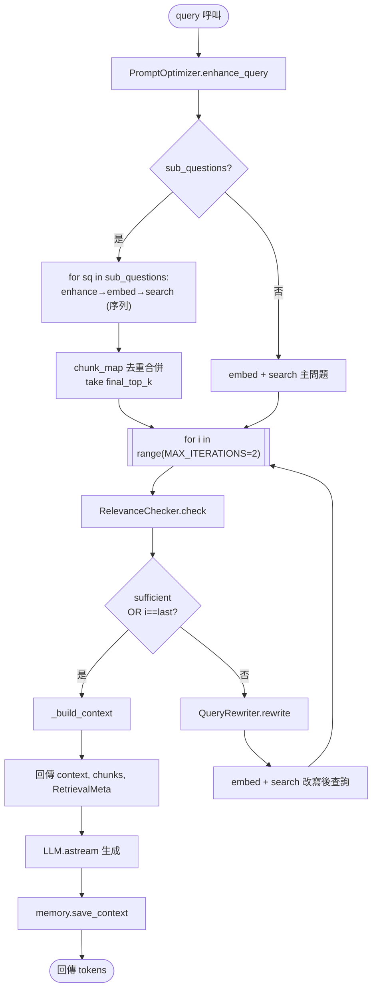
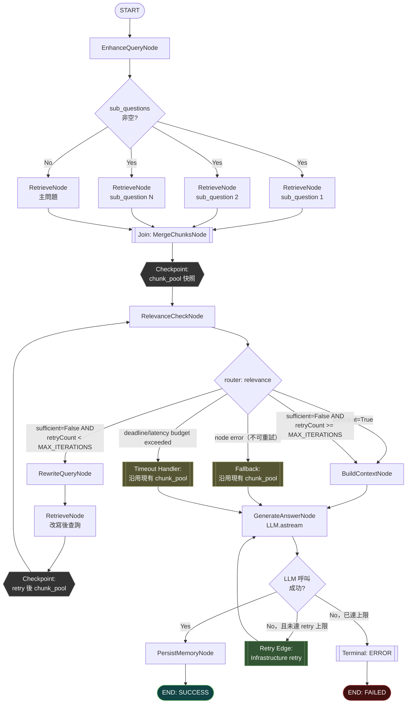

# Target Graph Design — Agentic RAG Retrieval

**Date**: 2026-08-03 · **Branch**: `feat/graph-agentic-retrieval`
**Scope**: `services/kb-api/src/rag/agentic_pipeline.py::AgenticRAGPipeline._retrieve()`

---

## 2.1 Current Flow（依實際程式碼繪製）

來源：`services/kb-api/src/rag/agentic_pipeline.py` `_retrieve()` / `_do_retrieve()`（第 153-227 行）。

**觀察**：
- Sub-question 迴圈是**序列**執行（可平行化但未平行化）。
- Self-reflection 迴圈的終止條件（`sufficient` / `i == MAX_ITERATIONS-1`）與「要不要繼續」耦合在一個 for-loop 的 if 判斷裡，沒有獨立的 Router。
- 沒有任何 checkpoint；一次 process crash 等於整個 retrieval 重來。
- 沒有逐節點 trace，只有一個外層 Langfuse span 包住整個 `_do_retrieve()`。

---

## 2.2 Target Graph

**圖例對應**：

| 元素 | 圖上標記 |
|---|---|
| START/END | `([...])` 圓角節點 |
| Node | 方框（`N1`–`N7`） |
| Deterministic edge | 無標籤箭頭（如 `J1 → CP1`） |
| Conditional edge | `R1`/`R2`/`R3` 決策點上的分支標籤 |
| Retry edge | `RetryLLM`、`N4 → N2R → CP2 → N3`（rewrite-retry 迴圈） |
| Failure/Fallback edge | `FB`、`ERR` |
| Parallel branch | `R1 -- Yes` 下的 `N2P1/N2P2/N2P3` |
| Join point | `J1` |
| Checkpoint | `CP1`、`CP2`（雙線框） |
| Terminal state | `END`、`ENDERR` |

**注意**：此版本**沒有** Human-in-the-loop 節點——F4 是唯讀檢索流程，不涉及刪除資料、付款、對外發布等高風險操作，因此 Phase 1 不引入 approval gate（符合任務原則「不要為了用 Graph 而加不必要的節點」）。若未來 `relevance_sufficient=False` 且已達重試上限的比例持續偏高，可在 `N5`（BuildContextNode）之後、`N6`（生成）之前插入一個 `LowConfidenceEscalationNode`（見 `graph-migration-plan.md`），但本次不實作。

---

## 對照：Graph 化前後差異

| 面向 | Before | After |
|---|---|---|
| Sub-question 檢索 | 序列 for-loop | 平行 Node + Join（同一 event loop 內用 `asyncio.gather`） |
| 迴圈終止條件 | 埋在 for-loop if/else | 獨立 deterministic router `route_after_relevance_check()` |
| 逐輪 observability | 迴圈結束後一次 log | 每個 Node 進出都記錄 `node_name/duration/route_decision` |
| 錯誤處理 | try/except silent fallback（`sufficient=True`） | Node 內部仍保留相同 fallback 語義，但**明確標記為 `error_category`**，可與「內容真的夠」區分 |
| 對外 API 契約 | `ChatResponseDTO(retrieval_iterations, relevance_sufficient)` | 不變 |
| 切換方式 | N/A | `AppSettings.agentic_retrieval_graph_enabled`（預設 `False`） |

State Schema、Node Contract、Router 規則細節見對應文件：`graph-state-schema.md`、`graph-node-contracts.md`。
